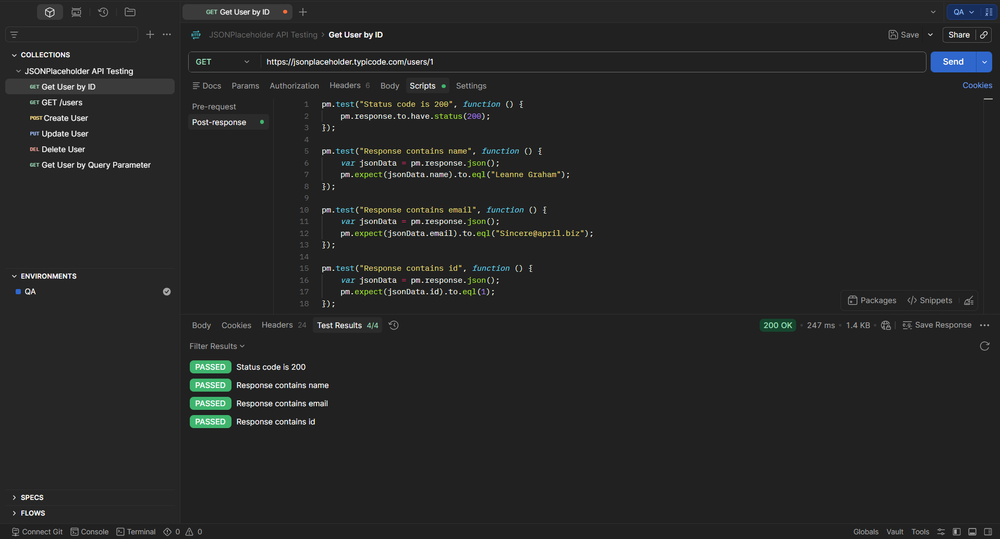

# TE-001 - Get User by ID

## Test Execution Information

| Field | Value |
|-------|-------|
| **Execution ID** | TE-001 |
| **Related Test Case** | TC-001 |
| **Execution Date** | (Execution Date) |
| **Tester** | Richard Sanchez |
| **Environment** | QA |
| **Result** | Passed |

---

## Objective

Execute TC-001 to verify that the API returns the correct user when requesting an existing User ID.

---

## Execution Steps

| Step | Expected Result | Actual Result | Status |
|------|-----------------|---------------|--------|
| Send GET request to `/users/1`. | Request is processed successfully. | Status Code **200 OK**. | ✅ Pass |
| Validate the response body. | User information is returned. | User information returned correctly. | ✅ Pass |
| Validate the user ID. | ID equals **1**. | ID returned is **1**. | ✅ Pass |

---

## Summary

The API successfully returned the requested user information.

---

## Final Result

**PASSED** ✅

---

## Evidence

### Screenshot

### Description

The screenshot shows the successful execution of the GET request, including the response body and HTTP Status Code **200 OK**.

---

## Observations

The endpoint returned the expected resource and correctly identified the requested user.