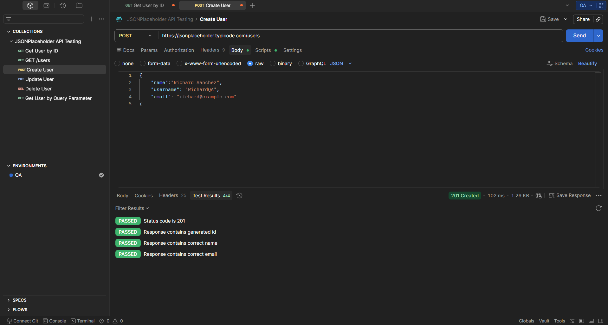

# TE-002 - Create User

## Test Execution Information

| Field | Value |
|-------|-------|
| **Execution ID** | TE-002 |
| **Related Test Case** | TC-002 |
| **Execution Date** | (Execution Date) |
| **Tester** | Richard Sanchez |
| **Environment** | QA |
| **Result** | Passed |

---

## Objective

Execute TC-002 to verify that a new user can be created successfully.

---

## Execution Steps

| Step | Expected Result | Actual Result | Status |
|------|-----------------|---------------|--------|
| Send POST request. | Request processed successfully. | Status Code **201 Created**. | ✅ Pass |
| Validate generated ID. | New ID is returned. | ID generated successfully. | ✅ Pass |
| Validate response body. | User information returned. | User information returned correctly. | ✅ Pass |

---

## Summary

The API successfully simulated the creation of a new user.

---

## Final Result

**PASSED** ✅

---

## Evidence

### Screenshot

### Description

The screenshot shows the POST request execution with Status Code **201 Created** and the generated user information.

---

## Observations

JSONPlaceholder simulates resource creation without persisting the new record.