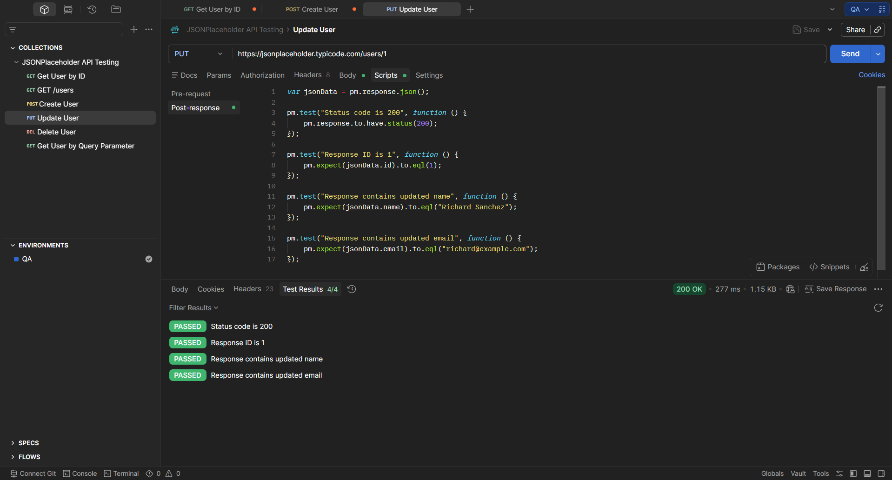

# TE-003 - Update User

## Test Execution Information

| Field | Value |
|-------|-------|
| **Execution ID** | TE-003 |
| **Related Test Case** | TC-003 |
| **Execution Date** | (Execution Date) |
| **Tester** | Richard Sanchez |
| **Environment** | QA |
| **Result** | Passed |

---

## Objective

Execute TC-003 to verify that an existing user can be updated.

---

## Execution Steps

| Step | Expected Result | Actual Result | Status |
|------|-----------------|---------------|--------|
| Send PUT request. | Request processed successfully. | Status Code **200 OK**. | ✅ Pass |
| Validate updated data. | Updated values are returned. | Response matches updated data. | ✅ Pass |

---

## Summary

The API successfully simulated the update operation.

---

## Final Result

**PASSED** ✅

---

## Evidence

### Screenshot

### Description

The screenshot shows the successful PUT request execution with Status Code **200 OK** and the updated user information.

---

## Observations

The endpoint returned the updated payload correctly.