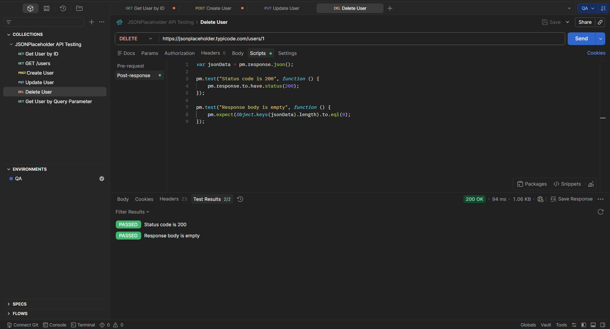

# TE-004 - Delete User

## Test Execution Information

| Field | Value |
|-------|-------|
| **Execution ID** | TE-004 |
| **Related Test Case** | TC-004 |
| **Execution Date** | (Execution Date) |
| **Tester** | Richard Sanchez |
| **Environment** | QA |
| **Result** | Passed |

---

## Objective

Execute TC-004 to verify that an existing user can be deleted successfully.

---

## Execution Steps

| Step | Expected Result | Actual Result | Status |
|------|-----------------|---------------|--------|
| Send DELETE request to `/users/1`. | Request is processed successfully. | Status Code **200 OK**. | ✅ Pass |
| Validate the response body. | Empty response body is returned. | Response body is `{}`. | ✅ Pass |

---

## Summary

The API successfully simulated the deletion of the selected user.

---

## Final Result

**PASSED** ✅

---

## Evidence

### Screenshot

### Description

The screenshot shows the successful DELETE request execution with Status Code **200 OK** and an empty response body (`{}`).

---

## Observations

JSONPlaceholder simulates the DELETE operation without permanently removing the resource.