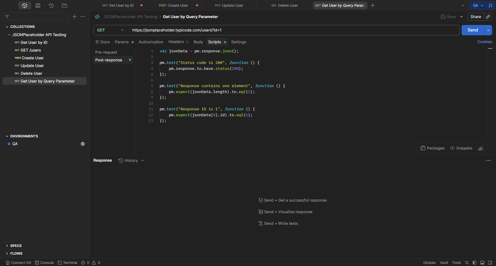

# TE-005 - Filter Users by Query Parameter

## Test Execution Information

| Field | Value |
|-------|-------|
| **Execution ID** | TE-005 |
| **Related Test Case** | TC-005 |
| **Execution Date** | (Execution Date) |
| **Tester** | Richard Sanchez |
| **Environment** | QA |
| **Result** | Passed |

---

## Objective

Execute TC-005 to verify that the API correctly filters users using query parameters.

---

## Execution Steps

| Step | Expected Result | Actual Result | Status |
|------|-----------------|---------------|--------|
| Send GET request to `/users?id=1`. | Request is processed successfully. | Status Code **200 OK**. | ✅ Pass |
| Validate response size. | One record is returned. | One record returned. | ✅ Pass |
| Validate returned ID. | User ID equals **1**. | Returned ID is **1**. | ✅ Pass |

---

## Summary

The API successfully filtered the user collection using the specified query parameter.

---

## Final Result

**PASSED** ✅

---

## Evidence

### Screenshot

### Description

The screenshot shows the successful execution of the filtered GET request using the `id` query parameter.

---

## Observations

The endpoint correctly filtered the results and returned only the matching user.