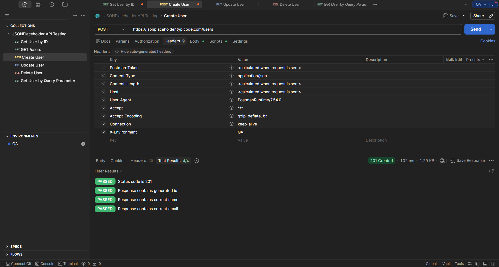

# TE-006 - Verify HTTP Headers

## Test Execution Information

| Field | Value |
|-------|-------|
| **Execution ID** | TE-006 |
| **Related Test Case** | TC-006 |
| **Execution Date** | (Execution Date) |
| **Tester** | Richard Sanchez |
| **Environment** | QA |
| **Result** | Passed |

---

## Objective

Execute TC-006 to verify that HTTP headers are correctly sent and processed during API requests.

---

## Execution Steps

| Step | Expected Result | Actual Result | Status |
|------|-----------------|---------------|--------|
| Configure the custom header `X-Environment: QA`. | Header is added to the request. | Header configured successfully. | ✅ Pass |
| Send POST request. | Request is processed successfully. | Status Code **201 Created**. | ✅ Pass |
| Review the request headers. | Custom header is included. | Header was successfully sent. | ✅ Pass |

---

## Summary

The custom header was successfully included in the request and processed without affecting the API behavior.

---

## Final Result

**PASSED** ✅

---

## Evidence

### Screenshot

### Description

The screenshot shows the configured HTTP headers and the successful API response after executing the request.

---

## Observations

JSONPlaceholder ignores custom headers because it is a mock API. In production environments, custom headers are commonly used for authentication, versioning, and environment identification.