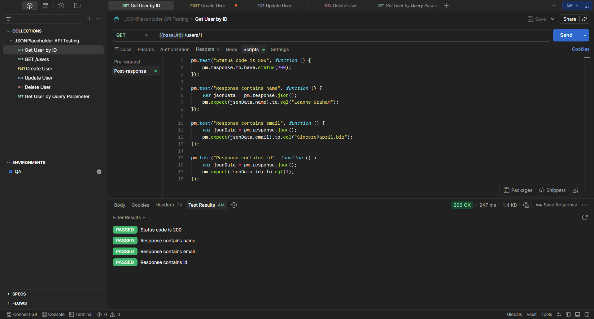

# TE-007 - Verify Environment Variables Configuration

## Test Execution Information

| Field | Value |
|-------|-------|
| **Execution ID** | TE-007 |
| **Related Test Case** | TC-007 |
| **Execution Date** | (Execution Date) |
| **Tester** | Richard Sanchez |
| **Environment** | QA |
| **Result** | Passed |

---

## Objective

Execute TC-007 to verify that API requests correctly use the configured Environment Variable (`baseUrl`).

---

## Execution Steps

| Step | Expected Result | Actual Result | Status |
|------|-----------------|---------------|--------|
| Select the QA Environment. | QA Environment is activated. | QA Environment was successfully selected. | ✅ Pass |
| Verify the `baseUrl` variable. | Variable contains the API base URL. | Variable was correctly configured. | ✅ Pass |
| Execute GET request using `{{baseUrl}}/users/1`. | Request executes successfully. | Status Code **200 OK**. | ✅ Pass |
| Validate the response body. | User information is returned. | User information returned correctly. | ✅ Pass |

---

## Summary

The request was successfully executed using the configured Environment Variable without requiring a hardcoded URL.

---

## Final Result

**PASSED** ✅

---

## Evidence

### Screenshot

### Description

The screenshot shows the QA Environment selected, the request executed using `{{baseUrl}}`, the HTTP Status Code **200 OK**, and the returned user information.

---

## Observations

Environment Variables simplify API maintenance and allow the same collection to be executed across different environments without modifying individual requests.