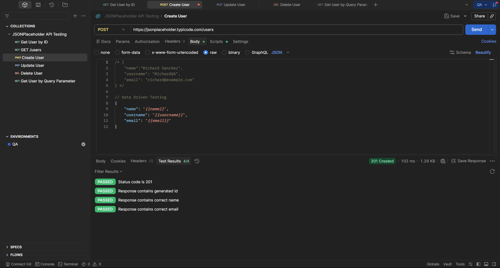

# TE-008 - Data Driven Testing Preparation

## Test Execution Information

| Field | Value |
|-------|-------|
| **Execution ID** | TE-008 |
| **Related Test Case** | TC-008 |
| **Execution Date** | (Execution Date) |
| **Tester** | Richard Sanchez |
| **Environment** | QA |
| **Result** | Not Executed |

---

## Objective

Verify that the API collection is correctly prepared for Data Driven Testing using a CSV file.

---

## Execution Steps

| Step | Expected Result | Actual Result | Status |
|------|-----------------|---------------|--------|
| Create the CSV file containing multiple users. | CSV file created successfully. | CSV file created successfully. | ✅ Pass |
| Parameterize the POST request using variables. | Variables correctly referenced. | Request body successfully parameterized. | ✅ Pass |
| Attempt to execute the Collection Runner. | Collection executes using CSV data. | Execution could not be completed due to the free version limitation of Postman. | ⚠ Not Executed |

---

## Summary

The Data Driven Testing configuration was completed successfully.

The execution could not be performed because the Collection Runner feature required for CSV execution was unavailable in the current Postman license.

---

## Final Result

**NOT EXECUTED** ⚠

---

## Evidence

### Screenshot

### Description

The screenshot shows the configured CSV file and the Postman message indicating the execution limitation due to the current license.

---

## Observations

Although the execution was not completed, the Data Driven Testing configuration follows the correct implementation and can be executed without modification in a version of Postman that supports CSV execution.