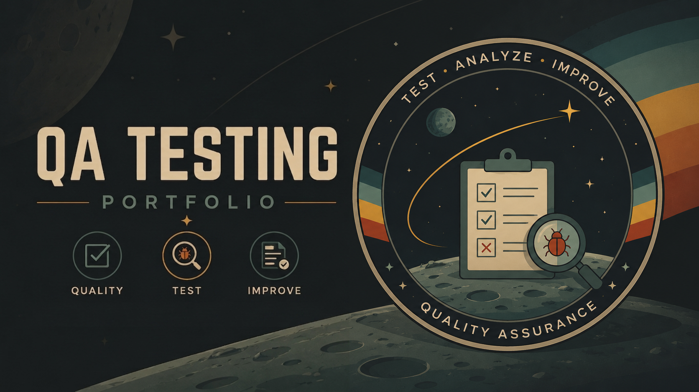
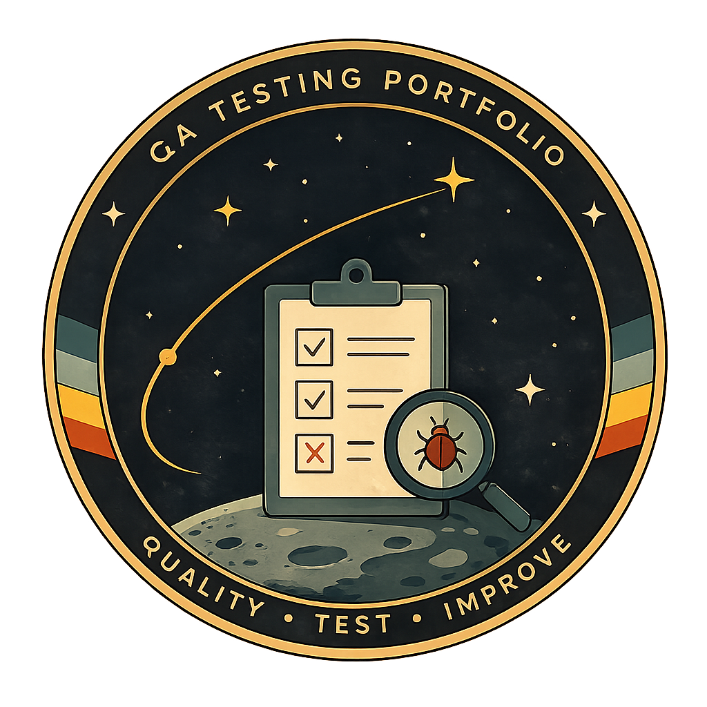

<p align="center">
  
</p>

---

# QA Engineer Portfolio

Welcome to my Quality Assurance portfolio.

This repository showcases my learning journey through hands-on projects organized by QA disciplines, including **Manual Testing**, **API Testing**, **Database Testing**, and **Automation Testing**.

Each project demonstrates industry-standard QA practices such as test planning, test case design, test execution, bug reporting, evidence collection, traceability, and technical documentation.

My goal is to continuously expand this portfolio with automation frameworks, database validation, API automation, and CI/CD while developing the skills required for a professional QA Engineer role.

---

# Repository Structure

```text
QA-Engineer-Portfolio
│
├── Manual-Testing
│   ├── SauceDemo
│   ├── OrangeHRM
│   └── ExploratoryTesting
│
├── API-Testing
│   └── JSONPlaceholder
│
├── Database-Testing
│   └── SQL-Practice
│
├── Automation-Testing
│   └── (Coming Soon)
│
├── docs
│
└── README.md
```

---

# Portfolio Summary

| QA Area | Projects | Status |
|---------|----------|--------|
| Manual Testing | SauceDemo, OrangeHRM, Exploratory Testing | ✅ Completed |
| API Testing | JSONPlaceholder REST API | ✅ Completed |
| Database Testing | SQL Practice | ✅ Completed |
| Automation Testing | Playwright + TypeScript | 🚧 Coming Soon |

---

# Project Details

# Manual Testing

---

## 1. SauceDemo

**Application Type:** E-commerce Web Application

**Testing Type:** Manual Testing

### Modules Tested

- Login
- Products
- Cart
- Checkout

### Test Results

| Module | Test Cases | Status |
|--------|-----------:|--------|
| Login | 5 | PASS |
| Products | 10 | PASS |
| Cart | 6 | PASS |
| Checkout | 6 | PASS |

**Total Test Cases:** 27

**Pass Rate:** 100%

### Deliverables

- Test Plan
- Test Cases
- Test Execution Results
- Bug Reports
- Test Evidence

---

## 2. OrangeHRM

**Application Type:** Human Resource Management System (HRMS)

**Testing Type:** Manual Testing

### Modules Tested

- Login
- Dashboard
- Admin
- PIM
- Leave
- Recruitment

### Test Results

| Module | Test Cases | Status |
|--------|-----------:|--------|
| Login | 6 | PASS |
| Dashboard | 5 | PASS |
| Admin | 5 | PASS |
| PIM | 5 | PASS |
| Leave | 5 | PASS |
| Recruitment | 5 | PASS |

**Total Test Cases:** 31

**Pass Rate:** 100%

### Deliverables

- Test Plan
- Test Cases
- Test Execution Results
- Bug Reports
- Test Evidence

---

## 3. Exploratory Testing

**Application Type:** QA Practice Web Application

**Testing Type:** Exploratory Testing

### Modules Explored

- Form Authentication
- Dynamic Controls
- Dropdown
- Inputs

### Test Results

| Area | Status |
|------|--------|
| Form Authentication | PASS |
| Dynamic Controls | PASS (1 Defect Found) |
| Dropdown | PASS |
| Inputs | PASS |

### Defects Identified

| Bug ID | Severity | Status |
|--------|----------|--------|
| BUG-001 | Medium | Open |

### Deliverables

- Test Notes
- Bug Reports
- Test Evidence

---

# API Testing

---

## 1. JSONPlaceholder REST API

**Testing Type:** Manual API Testing using Postman

### Topics Covered

- GET Requests
- POST Requests
- PUT Requests
- DELETE Requests
- Query Parameters
- HTTP Headers
- Environment Variables
- Collection Variables
- Data Driven Testing
- Response Validation
- HTTP Status Codes

### Test Results

| Feature | Status |
|---------|--------|
| CRUD Operations | PASS |
| Query Parameters | PASS |
| HTTP Headers | PASS |
| Environment Variables | PASS |
| Data Driven Testing | Configured |

### Deliverables

- Test Cases
- Test Execution Reports
- Testing Evidence
- QA Analysis Notes
- Traceability Matrix
- Postman Collection
- Postman Environment

---

# Database Testing

---

## 1. SQL Practice

**Project Type:** SQL Fundamentals for Quality Assurance

### Topics Covered

- SELECT
- WHERE
- ORDER BY
- Aggregate Functions
- INNER JOIN
- LEFT JOIN
- GROUP BY
- HAVING

### Deliverables

- SQL Query Files
- Learning Notes
- Documentation

---

# Automation Testing

---

## Coming Soon

Projects planned for this section include:

- Playwright + TypeScript
- API Automation
- End-to-End Test Automation
- Advanced SQL Testing
- GitHub Actions (CI/CD)
- Performance Testing
- Mobile Testing (Appium)

---

# Skills Demonstrated

## Manual Testing

- Test Planning
- Test Case Design
- Test Execution
- Bug Reporting
- Exploratory Testing
- Evidence Collection

### Projects

- SauceDemo
- OrangeHRM
- Exploratory Testing

---

## API Testing

- REST API Testing
- HTTP Methods
- HTTP Status Codes
- Response Validation
- Query Parameters
- HTTP Headers
- Environment Variables
- Collection Variables
- Data Driven Testing
- Traceability Matrix
- QA Documentation

### Projects

- JSONPlaceholder REST API

---

## Database Testing

- SQL Fundamentals
- Database Validation
- Data Analysis

### Projects

- SQL Practice

---

## Version Control & Documentation

- Git
- GitHub
- Markdown
- Professional QA Documentation

---

# Tools Used

- Postman
- JSONPlaceholder REST API
- Google Chrome
- OrangeHRM
- SauceDemo
- SQL
- Git
- GitHub
- Markdown

---

# Future Learning Roadmap

This portfolio will continue to grow with professional QA projects covering:

- Manual Testing
- API Testing
- Database Testing
- Automation Testing
- CI/CD
- Performance Testing
- Mobile Testing

---

# About Me

I am an **Electronic Engineer** currently transitioning into **Quality Assurance Engineering**.

Through this portfolio, I document my continuous learning journey by developing real-world QA projects that demonstrate both technical knowledge and professional documentation practices.

My objective is to become a QA Engineer with strong skills in Manual Testing, API Testing, Database Validation, and Test Automation using modern industry tools.

---

<p align="center">
  
</p>